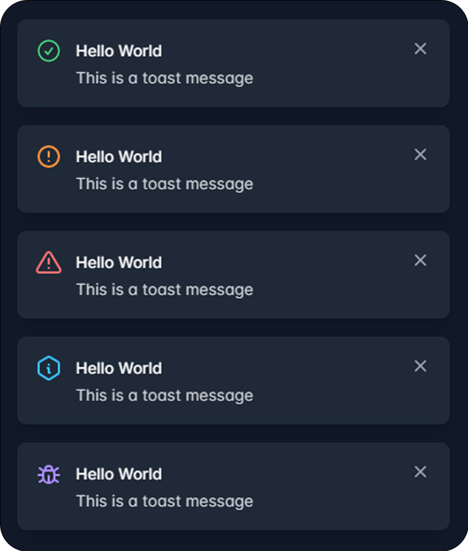
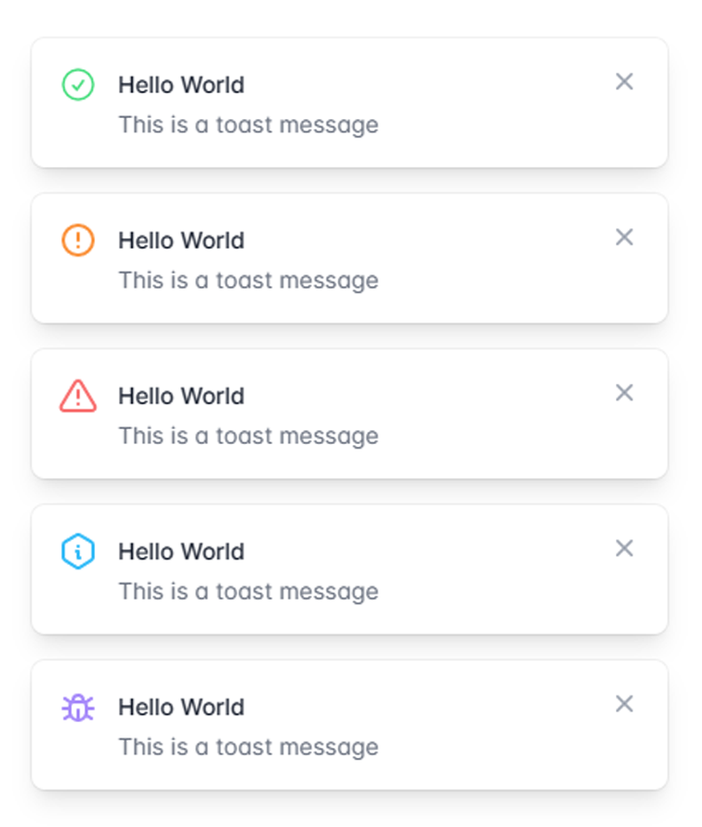

# **Lazy Toast TailwindCSS**
## A simple Toast component for TailwindCSS

### **#Development**
```bash
npm install
npx tailwindcss -i ./src/tailwind.css -o ./dist/app.css --watch
```

### **#Config**
```js
// config toast
const toast = new LazyToast({
    duration:31000,
    position: 'top-right',
});

// options
// duration: number
// position: string (top-right, top-left,top-center, bottom-right, bottom-left bottom-center)


// show toast
toast.toast({
    title: 'Hello World',
    msg: 'This is a toast message',
    style: 'success',
    css: ''
});

// options
// style: string (success, error, warning, info, bug)
// css: string (custom css) if css not change use !important ex !bg-red-500 !text-white
```

### **#Preview**
<!-- center -->
<div style="display: flex; justify-content: center; align-items: center; flex-direction: column; margin-bottom: 20px">


</div>
<h3><strong>Contribution : </strong></h3>
<a href="https://github.com/ilsyaa"></a>